# [Coffee Lovers](https://ms-3-coffee-lovers.herokuapp.com/)

Coffee Lovers is a website where users can view coffee brewing recipes and contribute by sharing their own recipes on the website for other users. This website has been created for my third milestone project as part of the Diploma in Full Stack Software Development course with Code Institute. The website is responsive on all device sizes.

***

## Table of contents

-  [Demo](#demo)
-  [Overview](#overview)
-  [User Experience (UX)](#user-experience)
    - [Strategy](#strategy)
        - [User Stories](#user-stories)
    - [Scope](#scope)
        - [Existing Features](#existing-features)
        - [Features Left to Implement when skills develop](#features-left-to-implement-when-skills-develop)
    - [Structure](#structure)
        - [Flowchart](#flowchart)
    - [Skeleton](#skeleton)
        - [Wireframe mock ups](#wireframe-mock-ups)
    - [Surface](#surface)
        - [Color Scheme](#color-scheme)
        - [Typography](#typography)
        - [Images](#images)
-  [Technologies used](#technologies-used)
    - [Tools](#tools)
    - [Front-End Technologies](#front-end-technologies)
    - [Back-End Technologies](#back-end-technologies)
-  [Resources](#resources)
-  [Testing](#testing)
    - [Testing User Stories](#testing-user-stories)
    - [Compatibility and Responsiveness](#compatibility-and-responsiveness)
    - [Validation](#validation)
    - [Manual Testing](#manual-testing)
-  [Code validity](#code-validity)
-  [Version Control](#version-control)
-  [Deployment](#deployment)
    - [Local Deployment](#local-deployment)
    - [Remote Deployment](#remote-deployment)
-  [Credits](#credits)
    - [Media](#media)
    - [Content](#content)
    - [Code Snippets](#code-snippets)
-  [Acknowledgments](#acknowledgements)

***

## Demo
Please click on the image to open link in a new browser window.<br><br>
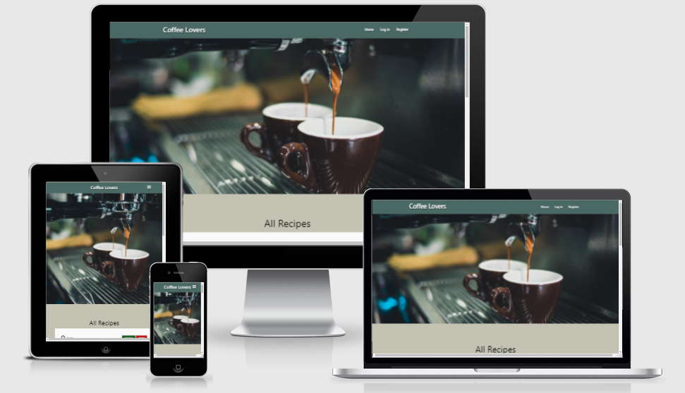 

A live demo can be found - [here](https://ms-3-coffee-lovers.herokuapp.com/)

***

## Overview
This is a Coffee Lovers page, which has been designed solely for coffee lovers who would like to find and share their own coffee brewing recipes with other members of the community. This website has been built for my third milestone project which is part of the Code Institute’s FullStack Software Development Diploma Course, and the main focus is to build a full-stack website allowing users to manage a common dataset. This project demonstrates the skills and knowledge of using the HTML5, CSS3, JavaScript, Python, Flask framework, Jinja templating language and MongoDB in Back-End development which I have learned recently on the course.

The aim of the project is to create a coffee brewing recipes website keeping in mind the CRUD functionalities: Create, Read, Update, and Delete recipes from the database. Upon registration, the user will be able to view their profile, create new recipes, update and delete their own recipes at any time. The website is created using the Materialize CSS responsive designing which provide a better user experience from mobile devices to tablets or larger screens. The website was created for educational purposes.

***

## User Experience
This website would advance the user's goals by providing CRUD functionality to the coffee recipes database. It advances the site owner's goals by being a regular user of the site themselves.

The User Experience for this site was planned & developed using the [5 Planes of UX Design](https://www.geeksinux.com/the-elements-of-user-experience-design/): Strategy, Scope, Structure, Skeleton, Surface.

### Strategy
#### User Stories

- As a first-time visitor to the website, I want to:
    - explore all the coffee recipes on the website added by different users.
    - use the search functionality to narrow down favourite recipes using the keywords.
    - contribute to the website by adding own favourite coffee recipes. 
    - experience easier registration process.

- As a returning visitor to the website, I want to:
    - explore all the coffee recipes on the website added by different users.
    - Search for recipes by keyword.
    - Login to my account to see recipes I have added.
    - Edit and Delete recipes that I have added.
    - Contact the site admin to request the addition of new brew methods.

- As the site owner, I want to:
    - Log in to the website as an admin account.
    - Create, Edit, and Delete coffee brewing recipes.
    - Create, Edit, and Delete coffee brew method categories.

### Scope
#### Existing Features
- Hero Image:
    - The hero image of coffee being extracted from the coffee machine hints user that the site content relates to a coffee website.
- Search Functionality:
    - The search functionality allows all users, registered, or unregistered to search for coffee recipes by keywords.
- Register:
    - Users can very simply create an account on the website, the user input is validated, a new "user" document in the site's database is created, and hashing is used for password security. After an account is created, a flash message appears on the screen to showcase that the registration being successful and now the new user would be able to contribute by adding their favourite coffee brewing recipes. 
- Login/Logout:
    - The Login/Logout functionality adds authentication for registered users, allowing them to access, edit, and delete their own recipes. Allows users to logout by clearing the "session" cookie.
- Profile:
    - The Profile functionality provides registered & logged in users to see their own recipes (if any recipe created), add more recipes, edit or delete their existing recipes.
- Add Recipe:
    - The Add Recipe functionality provides registered users to add their own recipes via a form.
- Edit Recipe:
    - The Edit Recipe functionality provides registered users to edit recipes that they've added. Extra checks are in place here to ensure the current user matches the username of the user who created the recipe.
- Delete Recipe:
    - The Delete Recipe functionality provides registered users to delete recipes that they've added. Extra authentication steps are also in place in this feature to ensure that the current username matches that of the recipe's creator and a pop message appears for reconfirmation.
- Manage Brew Methods:
    - The Manage Brew Methods functionality provides the Admin of the site to view all of the coffee brew methods.
- Add Brew Method:
    - The Add Brew Method functionality provides a input field where the site admin can add new coffee brew method.
- Edit Brew Method:
    - The Edit Brew Method functionality provides a input field where the site admin can edit a coffee brew method.
- Delete Brew Method:
    - The Delete Brew Method functionality provides the site admin to remove brew methods from the site. Extra authentication steps are also in place in this feature where a pop message appears for reconfirmation.

#### Features Left to Implement when skills develop
- To display a collection of coffee brewing equipments for each coffee brewing methods and to include links for users intrested in purchasing them which would generate commission revenues.
- To include options for the users to vote on the best recipes per their experience.
- To include option for the users to upload images of the brewing recipes.
- To be able to Edit or delete the recipes that have been added by any user on the site, to moderate the site's content.

### Structure
#### Flowchart
- Flowchart created using [Lucidchart](https://www.lucidchart.com):<br><br>
    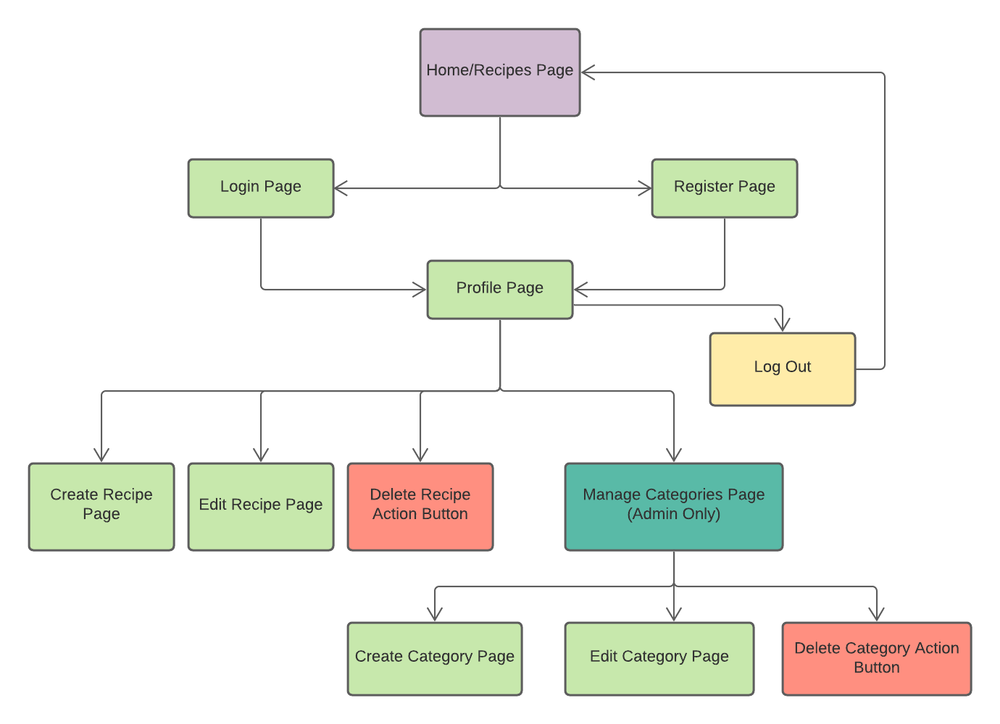<br><br>

### Skeleton
#### Wireframe mock ups
- Wireframes created using [Balsamiq](https://balsamiq.com/):<br><br>
    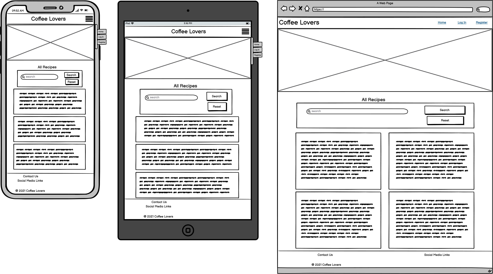<br>
    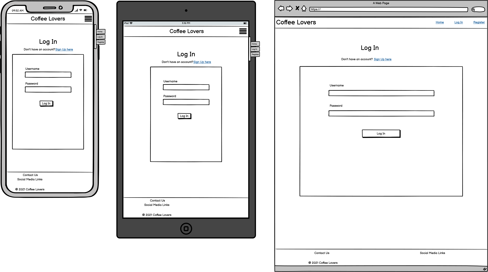<br>
    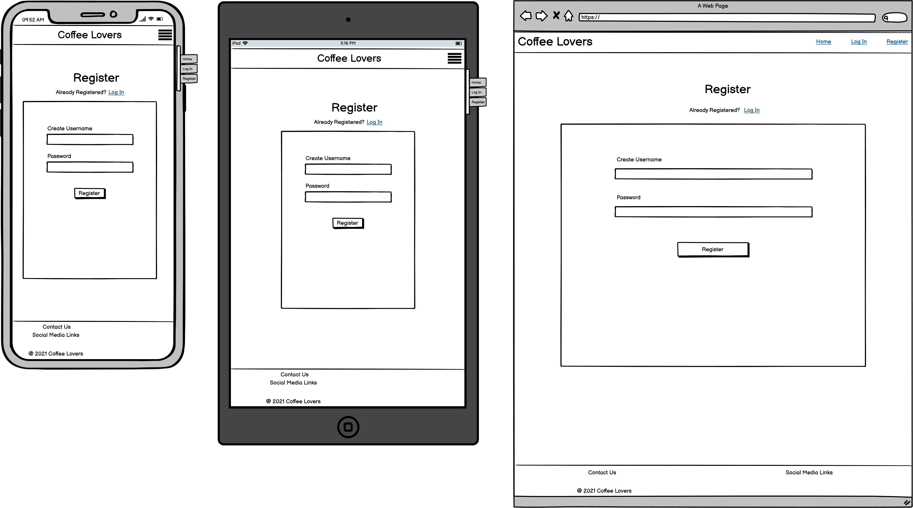<br>
    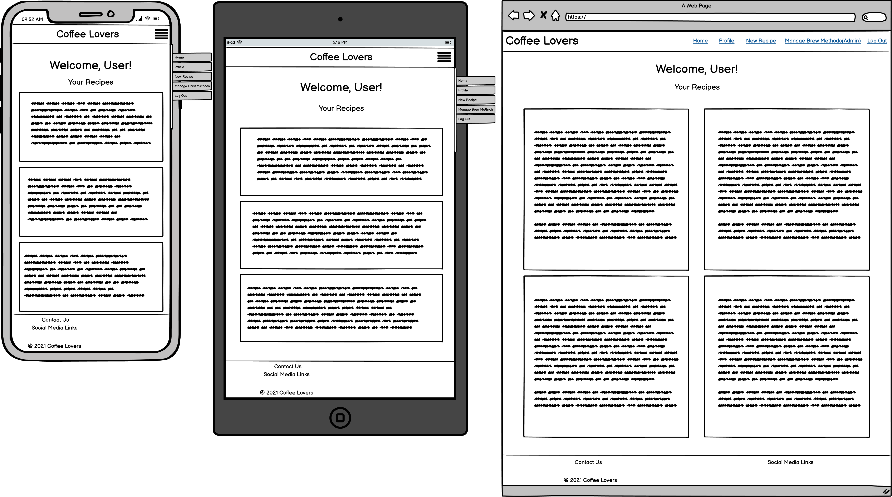<br>
    <br>
    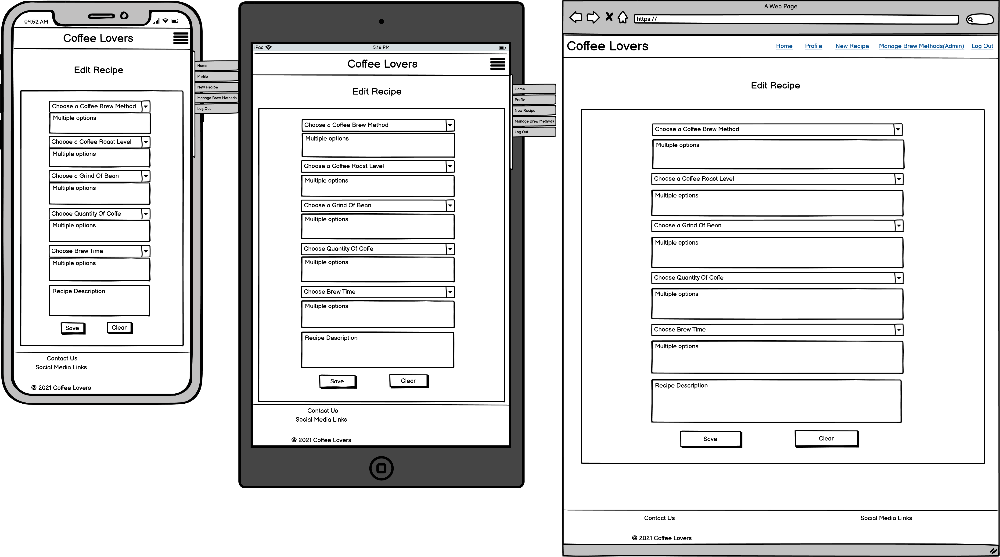<br>
    <br>
    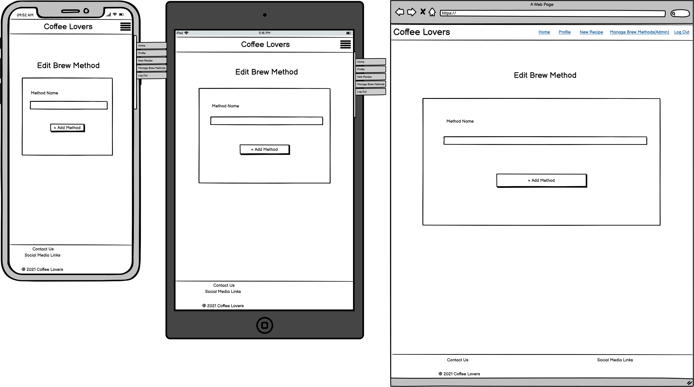<br>

### Surface
#### Color Scheme
- Chosen using [Image Color Picker](https://imagecolorpicker.com/en):<br><br>
    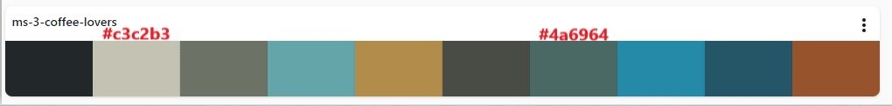<br><br>
- Primary color: #4a6964 (Cutty Sark Color) - This color applies to the header & footer section which maintains contrast to the landing page, and hero image.
- Background color: #c3c2b3 (Ash Color) - This color applies to the background.

#### Typography
- Materialize CSS default fonts applied.

#### Images
- The hero image of coffee being extracted from the coffee machine hints user that the site content relates to a coffee website.

***

## Technologies Used
### Tools
- [GitPod](https://www.gitpod.io/)
    - Used as the preferred IDE for development.
- [Git](https://git-scm.com/)
    - Used via the Gitpod terminal for version control, with regular commits, and to push to GitHub & Heroku.
- [GitHub](https://github.com/)
    - Used to store the site's code repository.
- [Heroku](https://www.heroku.com/)
    - Used to host the deployed site.
- [Lucidchart](https://www.lucidchart.com)
    - To create the site's structural flowchart.
- [Balsamiq](https://balsamiq.com/)
    - To create the site's wireframes.
- [Google Fonts](https://fonts.google.com/)
    - Used to import the site's fonts.
- [Compress JPEG](https://compressjpeg.com/)
    - Used to compress the site's hero image.
- [Cloudinary](https://cloudinary.com/)
    - Used to link image files to the README.md file.

### Front-End Technologies
- [HTML5](https://developer.mozilla.org/en-US/docs/Glossary/HTML5)
- [CSS3](https://developer.mozilla.org/en-US/docs/Web/CSS)
- [JavaScript](https://developer.mozilla.org/en-US/docs/Web/JavaScript)
- [JQuery 3.6.0](https://jquery.com/)
    - Used as the primary JavaScript library.
- [Materialize 1.0.0](https://materializecss.com/)
    - Used as a responsive front-end framework.

### Back-End Technologies
- [Python](https://www.python.org/)
- [Flask](https://flask.palletsprojects.com/en/2.0.x/)
    - Used with Python as the primary web microframework.
- [Jinja](https://jinja.palletsprojects.com/en/3.0.x/)
    - Used for creating templates with Flask.
- [Werkzeug](https://werkzeug.palletsprojects.com/en/2.0.x/)
    - Used for password hashing & authentication on the site.
- [MongoDB Atlas](https://www.mongodb.com/)
    - Used to store the site's database.
- [PyMongo](https://pypi.org/project/pymongo/)
    - Used to interact with the MongoDB database from Python.

***

## Resources

- [Code Institute Course Content](https://courses.codeinstitute.net/login) -Main source of fundamental knowledge.
- [Stack Overflow](https://stackoverflow.com/) -General resource.
- [Google chrome developer tools](https://developer.chrome.com/docs/devtools/) - used to check page elements, help debug issues with the site layout and test different CSS styles and console JS.
- [w3schools](https://www.w3schools.com/default.asp)-General resource.
- [Balsamic](https://balsamiq.com/wireframes/) - Wireframing design tool to create wireframes.
- [Am I Responsive](http://ami.responsivedesign.is/) - Responsive website mockup image generator.
- [Imagecolorpicker](https://imagecolorpicker.com/en) - color schemes generator.
- [a11y](https://color.a11y.com/Contrast/) - Website color contrast checker
- [Lighthouse Report Viewer](https://googlechrome.github.io/lighthouse/viewer/) - used as part of testing website on grounds of Performance, Accessibility, Best Practices and SEO.


***

## Testing
A live demo can be found - [here](https://ms-3-coffee-lovers.herokuapp.com/)<br>

### Testing User Stories
Testing User Stories from User Experience (UX) Section
As a first-time visitor to the website, I want to:
- explore all the coffee recipes on the website added by different users.
    - The landing page has heading called, All Recipes, and below that all the recipes added by other users are displayed.
    - The landing page, "Home" page is clearly visible on the Navbar which would redirect the users to the recipes page.
    - All Recipes are displayed with in the card panels which enhances and provides clear recipe information.
- use the search functionality to narrow down favourite recipes using the keywords.
    - The landing page has heading called, All Recipes, and under that there is a "Search Recipes" field which is clearly visible.
    - The search field can be used to search keywords relating to coffee recipes and click "Search" button. 
    - For the next search, the search field can be easily cleared by clicking "Reset" button.
- contribute to the website by adding own favourite coffee recipes. 
    - The "Register" button is clearly visible on the landing page and as well as on all pages on the Navbar.
    - The users are prompted to register an account by creating a unique username and password via a registration form on the "Register" page.
    - After registering an account, the "New Recipe" page will be visible to the user which would allow to add new recipes. 
- experience easier registration process.
    - The registration process is quite straightforward which only requires creating a unique username and password.

As a returning visitor to the website, I want to:
- explore all the coffee recipes on the website added by different users.
    - The landing page has heading called, All Recipes, and below that all the recipes added by other users are displayed.
    - The landing page, "Home" page is clearly visible on the Navbar which would redirect the users to the recipes page.
    - All Recipes are displayed with in the card panels which enhances and provides clear recipe information.
- use the search functionality to narrow down favourite recipes using the keywords.
    - The landing page has heading called, All Recipes, and under that there is a "Search Recipes" field which is clearly visible.
    - The search field can be used to search keywords relating to coffee recipes and click "Search" button. 
    - For the next search, the search field can be easily cleared by clicking "Reset" button.
- Login to my account to see recipes I have added:
    - The "Log In" button is clearly visible on the landing page and as well as on all pages on the Navbar.
    - On the Login page, users are prompted to log in to their account with their username and password.
    - After logging in, the user can go to the Profile page to view all their added recipes.
- Edit and Delete recipes that I have added.
    - Each recipe is displayed on a card panel with an Edit and Delete icon on the top right corner.
    - A conditional check is implemented where Edit and Delete icons only appear on the recipes added by the current user.
    - Edit icon is wired up to open an Edit Recipe page, a form is presented to the user, pre-filled with the current recipe information.
    - The user can edit the pre-filled information and click the "Save" button or "Clear" button to cancel the changes. After saving the changes, the user is redirected to the Home page, with a flash message confirming that the recipe has been updated.
    - Delete icon is wired up to a delete recipe functionality, which would require confirmation from the user by showing a pop message at the top of the window before deleting the recipe. 
    - The user can confirm their choice by clicking "Ok" or "Cancel" button and then they are redirected to Home page, and a flash message is populated confirming that the recipe has been deleted.
- Contact the site admin to request the addition of new brew methods:
    - Admin's email address has been provided in the Footer section for the user's potential queries.

As the site owner, I want to:
- Log in to the website as an admin account:
    - On the Login page, if an admin account exists, the admin can log in to their admin account with the username "admin" & their existing password.
- Create, Edit, and Delete coffee brewing recipes.
    - The admin as a user is able to create, read, edit, and delete their own recipes. 
    - Currently, on the Home page under All Recipes, the recipe cards don't show the conditional checks, Edit and Delete icons for recipes added by other users, this functionality was missed out as these features can be implement when skills develop.
- Create, Edit, and Delete coffee brew method categories.
    - The admin only has the access to see the additional page "Manage Brew Methods" which allows the admin to be able to create, read, edit, and delete Coffee Brew Methods.
    - The "Manage Brew Methods" button is clearly visible on the landing page and as well as on all pages on the Navbar.
    - On the Manage Brew Methods page, the admin is presented with a list of currently added brew methods from the MongoDB database. 
    - On the Manage Brew Methods page, the "Add Brew Method" button is immediately visible. When clicked, this button opens the "Add Brew Method" page.
    - On the Add Brew Method page, the admin is presented with a input field which prompts them to enter the name of the brew method.
    - After saving the brew method, the admin is redirected to the Manage Brew Methods page, with a flash message shown to confirm that the brew method has been added.
    - Each Brew Method is shown on a card with an Edit and Delete buttons displayed at the bottom.
    - Edit icon is wired up to open an edit brew method page, a form is presented to the user, pre-filled with the current brew method information.
    - The admin can edit the pre-filled information and click the "Save" button or "Clear" button to cancel the changes. After saving the changes, the admin is redirected to the Manage Brew Methods page, with a flash message confirming that the brew method has been updated.
    - Delete icon is wired up to a delete brew method functionality, which would require confirmation from the user by showing a pop message at the top of the window before deleting the brew method. 
    - The admin can confirm their choice by clicking "Ok" or "Cancel" button and then they are redirected to Manage Brew Methods page, and a flash message is populated confirming that the brew method has been deleted.


### Manual Testing
Manual testing was performed on the following elements that appear across all pages on the site, to ensure that all are working as expected;

#### All Pages
- Navbar
    - Test carried on the **Website Logo** which appears on the left of the menu bar to ensure it points to the Home page.
    - Test carried on the website pages such as  **Home, login, Register, Profile, New Recipe, Manage Brew Methods** pages to ensure each point to respective page.
    - Collapsible sidebar button opens the sidebar navigation element on mobile devices.
    - All navigation links within the collapsible sidebar correctly direct the user to the corresponding site page.
    - Test carried on the Login & Register navigation links which only appear when the user is unregistered.
    - Test carried on the Profile and Logout navigation links correctly appear only when a user is already logged in and the logout button logs the user out.
    - Test carried on the Manage Brew Methods navigation link which appears only when the "admin" user is logged in. 
    - Test carried on the links and action buttons such as **Search, Reset, Add, Edit, Delete, Save, Clear** to ensure specific action takes place.
    - Test carried by hovering the mouse over the navigation links which triggers the expected hover effect color.
- Footer
    - Test carried on the **Social Media icons** in the Footer to ensure the specific link opens the correct pages, and in the new tab.
    - Test carried by hovering the mouse over the footer links which triggers the expected hover effect color.

#### Recipes Page (Home Page)
Manual testing was performed on the following elements that appear on the Recipes/Home page;
    - Test carried on the website pages such as  **Home, login, Register, Profile, New Recipe, Manage Brew Methods** pages to ensure each point to respective page.
- Hero Section:
    - Test carried on the Hero image which is appropriately responsive across all device sizes.
    - Test carried on the Login & Register buttons which appear when the user is unregisetered.
    - Test carried on the Profile button which correctly appears only when a user is already logged in.
    - Test carried on the Manage Brew Methods button which appears only when the "admin" user is logged in.
- Search Section:
    - Test carried on the Search functionality which validates whitespace and min/max input lengths.
    - An error message is surfaced when no database documents match the search term.
    - Reset button reloads the page to clear search terms & re-populate all recipe cards.
- Recipe Cards:
    - Recipe info is correctly iterated over to create a card for each recipe.
    - Edit & Delete icons only appear for registered users, and only on recipes that match the current user.

#### Login Page
Manual testing was performed on the following elements that appear on the Login page:
- Test carried on the "Register Here" link which correctly directs to the Register page for users who are not yet registered.
- Test carried on the Login form input field which validate whitespace, minlength, maxlength, and required patterns.
- Login functionality correctly performs validation checks to ensure that the username exists, and that the password is correct for that user.
- An error message is displayed if the username does not exist, or if the user's password is incorrect.
- After successfully logging in, the user is directed to the Home page, with a flash message to confirm that they are logged in.

#### Register Page
Manual testing was performed on the following elements that appear on the Registration page:
- Test carried on the "Log In Here" link which correctly directs to the login page for users who already have an account.
- Test carried on the Username input field which validates that the input value does not match an existing username.
- Username & password inputs validate whitespace, minlength, maxlength, and required patterns.
- Test carried on the Register button which correctly triggers a User document to be created in the MongoDB database.
- After successful registration, the user is automatically logged in and directed to the Home page, with a flash message populated to confirm that their registration was successful.

#### Profile Page
Manual testing was performed on the following aspects of the Profile page:
- After logging in, a flash message displays the correct user name to confirm that the login was successful.
- Test carried on the "Add Recipe" button which correctly directs the user to the Add Recipe page.
- Test carried by adding a recipe, and only the recipes added by the user appears on their profile.

#### Add, Edit, Delete Recipe Pages
Manual testing was performed on the following aspects of the Add, Edit, Delete Recipe Pages:
- Test carried out by adding a recipe, the form correctly populate the lists for coffee brew methods, coffee roast levels, and coffee grind of beans, quantity of coffee, brew time in the dropdown menus.
- Test carried out by editing a recipe, the form correctly pre-populates the existing values for each field of the existing recipe.
- The "Clear" button correctly redirects back to the Home page without submitting the form.
- When deleting a recipe, the delete icon is wired up to a delete recipe functionality, which would require confirmation from the user by showing a pop message at the top of the window before deleting the recipe. 
- The user can confirm their choice by clicking "Ok" or "Cancel" button and then they are redirected to Home page, and a flash message is populated confirming that the recipe has been deleted.

#### Manage Brew Methods Page (ADMIN)
Manual testing was performed on the following aspects of the Manage Brew Methods Page:
- The "Manage Brew Methods" button is clearly visible, correctly directs to the Add Brew Method page.
- Brew methods list is correctly iterated over to create a card for each brew method.

#### Add, Edit, Delete Brew Method (ADMIN)
Manual testing was performed on the following aspects of the Add, Edit, Delete Brew Method Pages:
- Test carried out by adding a brew method, the form correctly validates whitespace in brew method name.
- Test carried out by editing a brew method, the form correctly pre-populates the existing value of the brew method.
- Save button correctly triggers functionality to add brew method to database, and after successfully adding a brew method, directs the admin back to the Manage Brew Methods page with a success message populated.
- The "Clear" button correctly redirects back to the Manage Brew Methods page as expected without submitting the form.
- When deleting a brew method, the delete icon is wired up to a delete brew method functionality, which would require confirmation from the admin by showing a pop message at the top of the window before deleting the brew method. 
- The admin can confirm their choice by clicking "Ok" or "Cancel" button and then they are redirected to back to the Manage Brew Methods page, and a flash message is populated confirming that the brew method has been deleted.


### Further Manual Testing
- Checked grammar and spelling throughout document.
- Ran README text through [Online-Spellcheck](https://www.online-spellcheck.com/) to double-check on grammar and spelling.
- Ran CSS through [Autoprefixer](https://autoprefixer.github.io/) and copied the resulted CSS codes back into style.css file.

- Test carried on grounds of Performance, Accessibility, Best Practices and SEO using [Lighthouse Report Viewer](https://googlechrome.github.io/lighthouse/viewer/).<br><br>
    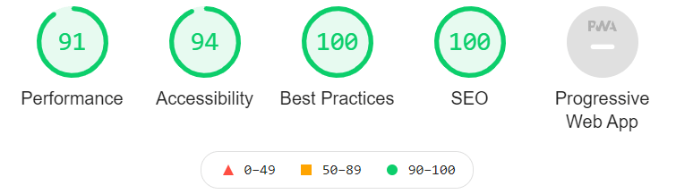<br><br>
    [Result](https://googlechrome.github.io/lighthouse/viewer/?psiurl=https%3A%2F%2F8080-tan-hippopotamus-ptxfv8r3.ws-eu15.gitpod.io%2F&strategy=mobile&category=performance&category=accessibility&category=best-practices&category=seo&category=pwa&utm_source=lh-chrome-ext)<br><br>

- Test carried on the overall site colours on [a11y](https://color.a11y.com/), a Color Contrast Accessibility Validator.<br><br>
    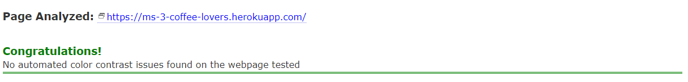<br><br>

### Compatibility and Responsiveness
The website has been tested on different browsers and electronic device, no compatibility issues noted. The site was found to be fully responsive on device sizes ranging from 320px X 480px to 1920px X 1080px.

- Browsers tested:
    - Chrome 
    - Safari 
    - Firefox 

- Devices tested:
    - iPhone 6
    - Samsung A20
    - Desktop PC
    - Laptop
    - Tablet

- Test carried on the Responsiveness of all pages using [Google Mobile-Friendly Test](https://search.google.com/test/mobile-friendly).<br><br>
    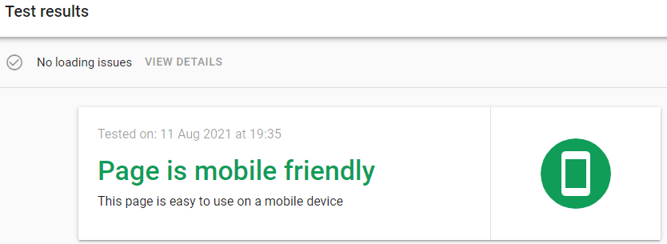<br>

### Validation
- Tested [HTML Validation](https://validator.w3.org/) No errors or warnings to show. This validator does not recognise Jinja templates & scripting, so returns errors for the lines of code where Jinja is used - this is to be expected. No errors are present in the HTML code otherwise.
- Tested [CSS Validation](https://jigsaw.w3.org/css-validator/) No errors found.<br><br>
    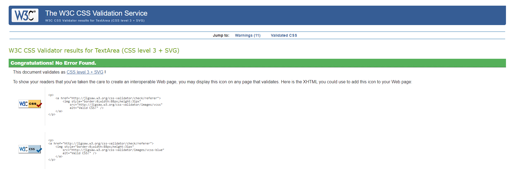<br>

- [JSHint](https://jshint.com/) was used to validate the JavaScript code in the script.js file. No errors are present.
- [PEP8 Online](http://pep8online.com/) was used to validate that the Python code in app.py is PEP8 compliant. No errors are present.<br><br>
    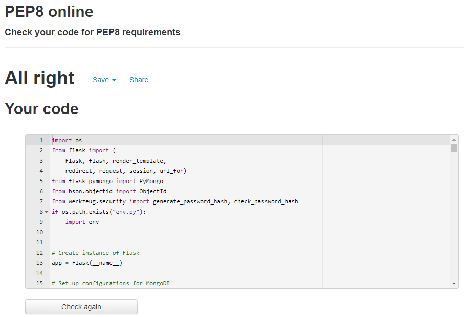<br><br>

***

## Code validity
- HTML - [Markup Validation W3C Service](https://validator.w3.org/)
- CSS - [Jigsaw  Validation W3C Service](https://jigsaw.w3.org/css-validator/)

***

## Version Control
- Used Git for version control.

***

## Deployment
### Local Deployment

The following dependencies will need to be installed in order to run this application locally:
- [Python3](https://www.python.org/downloads) to run the application.
- [PIP](https://pip.pypa.io/en/stable/installing) to install app requirements.
- [GitPod](https://www.gitpod.io/) or any preferred IDE, such as [VSCode](https://code.visualstudio.com/).
- [Git](https://git-scm.com/book/en/v2/Getting-Started-Installing-Git) for cloning and version control.
- [MongoDB](https://www.mongodb.com/) to create a database using MongoDB Atlas.

Follow the below steps for local deployment:

1. Clone the GitHub repository by entering the following command into the Git terminal:
    - `git clone https://github.com/Ranj247/ms-3-coffee-lovers.git`
2. After cloning the project, create an `env.py` file that includes the below code, replacing the `SECRET_KEY`, `MONGO_URI`, `MONGO_DBNAME` with your own credentials:
```
import os
os.environ.setdefault("IP", "0.0.0.0")
os.environ.setdefault("PORT", "5000")
os.environ.setdefault("SECRET_KEY", "YOUR_SECRET_KEY")
os.environ.setdefault("MONGO_URI", "YOUR_MONGO_URI")
os.environ.setdefault("MONGO_DBNAME", "coffee_lovers")
```
3. Create a `.gitignore` file and add the `env.py` file to the list of files.
4. Install all requirements from the [requirements.txt](https://github.com/Ranj247/ms-3-coffee-lovers/blob/main/requirements.txt) file using this command:
    - `pip3 -r requirements.txt`
5. Sign up for a [MongoDB](https://www.mongodb.com) account, and create a new Database called `coffee_lovers`. The collections in that database should be structured as follows:

**coffee_brew_methods**
```
_id: <ObjectId>
method_name: <string>
```

**recipes**
```
_id: <ObjectId>
recipe_method: <string>
roast_level: <string>
grind_of_bean: <string>
quantity_of_coffee: <string>
brew_time: <string>
recipe_description: <string>
created_by: <string>
```

**users**
```
_id: <ObjectId>
username: <string>
password: <string>
```

6. Run the app using the following command in the terminal:
    - `python3 app.py`

### Remote Deployment

To deploy this app on Heroku, the following steps were taken:

1. Create a `requirements.txt` file so Heroku can install the required dependencies.
    - `pip3 freeze --local > requirements.txt`
    - This project's requirements.txt file can be seen [here](https://github.com/Ranj247/ms-3-coffee-lovers/blob/main/requirements.txt).
2. Create a `Procfile` with information about the type of app that will be deployed.
    - `echo web: python app.py > Procfile`
    - This project's Procfile file can be seen [here](https://github.com/Ranj247/ms-3-coffee-lovers/blob/main/Procfile).
    - Make sure to delete the blank line at the end of the Profile, as this can cause issues when deploying to Heroku later.
3. Create a Heroku account, create a project app, and click the "Deploy" tab. 
4. "Connect GitHub" as the Deployment Method and select "Enable Automatic Deployment".
4. In the "Settings" tab, click the "Reveal Config Vars" button to configure environmental variables as follows:
    - **IP** : `0.0.0.0`
    - **PORT** : `5000`
    - **SECRET_KEY** : `<YOUR_SECRET_KEY>`
    - **MONGO_URI** : `<YOUR_MONGO_DB_URI>`
    - **MONGO_DBNAME**: `coffee_lovers`    
    
5. The app should now be deployed to Heroku - click the "Open App" button to view the deployed site.

***

## Credits
### Media
- [favicon.io](https://favicon.io/) was used to generate the site's favicon image.
- [Pexels](https://www.pexels.com/) used to source Hero image and customised to be used for the website.
- [Am I Responsive](http://ami.responsivedesign.is/) - was used to create the mock-up image used in the README file.

### Content
- [6 Popular Methods for Brewing Coffee at Home](https://treescoffee.com/blog/2016/04/6-popular-methods-for-brewing-coffee-at-home/) - inspiration for website content.

### Code Snippets
- Hero Image functionality adapted from [W3Schools](https://www.w3schools.com/howto/howto_css_hero_image.asp).
- Fixed Navbar functionality adapted from [W3Schools](https://www.w3schools.com/howto/howto_css_fixed_menu.asp).
- Navbar [Materialize CSS](https://materializecss.com/navbar.html).
- Sticky Footer functionality adapted from [Materialize CSS](https://materializecss.com/footer.html).
- Cards for recipe cards [Materialize CSS](https://materializecss.com/cards.html).
- Inspiration for the Coffee Lovers project came from the Code Institute coursework mini project, and several of the functionalities such as Searching Recipes, Authentications: Register, Login etc. adapted from mini project: (https://github.com/Code-Institute-Solutions/TaskManagerAuth).

***

## Acknowledgements
I would like to thank:
- My mentor, **Caleb Mbakwe**, for his guidance, valuable feedbacks, and encouragement throughout the project.
- **Istvan Orosz** for the immense support.
***
